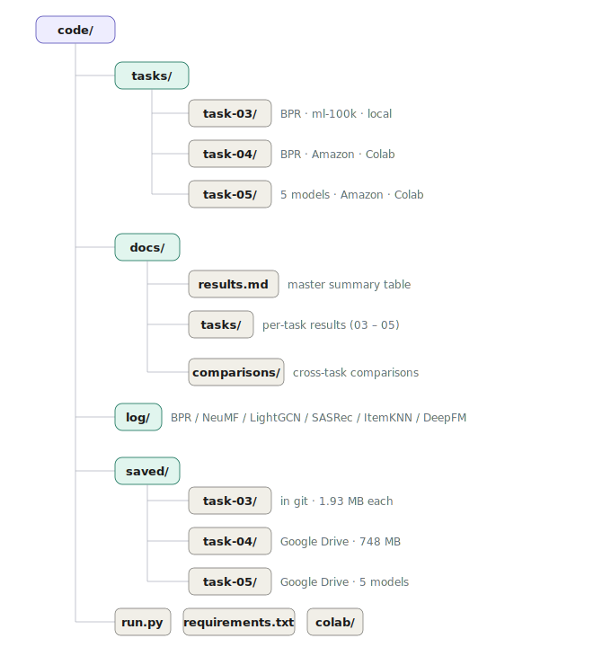

# Recommender Systems — Learning Experiments

Experiments in recommender systems using RecBole, covering multiple tasks and datasets.

## Repository Structure



## Setup

```bash
pip install -r requirements.txt
```

## Tasks

| Task | Dataset | Model | Environment | Results |
|---|---|---|---|---|
| task-03 | ml-100k | BPR | Local | [results](docs/tasks/task-03-results.md) |
| task-04 | Amazon Electronics | BPR | Google Colab | [results](docs/tasks/task-04-results.md) |
| task-05 | Amazon Electronics | NeuMF, LightGCN, SASRec, ItemKNN, DeepFM | Google Colab | [results](docs/tasks/task-05-results.md) |
